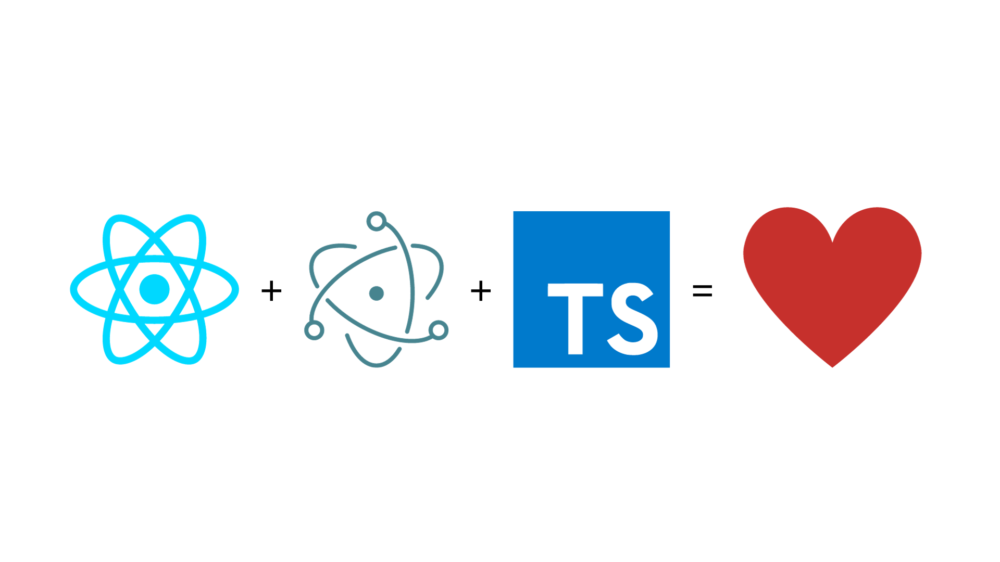

React + Electron + TypeScript = ❤️
===

### First Step
run in your terminal

### `npx create-react-app my-app --template typescript` 

or

### `yarn create react-app my-app --template typescript` 

and then run 

### `cd myapp` 

and then

### `npm install electron --save-dev`

or

### `yarn add --dev electron` 

### Second Step

Create folder `electron` in main directory

### Third Step

In folder `electron` create file `electron.ts`

### Fourth Step

In `electron.ts` paste 

```ts
// Modules to control application life and create native browser window
const {app, BrowserWindow} = require('electron')
const path = require('path')


function createWindow () {
  // Create the browser window.
  const mainWindow = new BrowserWindow({width: 800, 
                                        height: 600});

  // and load the index.html of the app.
  mainWindow.loadURL('http://localhost:3000');
}

// This method will be called when Electron has finished
// initialization and is ready to create browser windows.
// Some APIs can only be used after this event occurs.
app.whenReady().then(() => {
  createWindow()

  app.on('activate', function () {
    // On macOS it's common to re-create a window in the app when the
    // dock icon is clicked and there are no other windows open.
    if (BrowserWindow.getAllWindows().length === 0) createWindow()
  })
})

// Quit when all windows are closed, except on macOS. There, it's common
// for applications and their menu bar to stay active until the user quits
// explicitly with Cmd + Q.
app.on('window-all-closed', function () {
  if (process.platform !== 'darwin') app.quit()
})
```

### Fifth Step

In `package.json` add 

```json
"main": "./electron/electron.ts",
```

### Sixth Step

Always in `package.json` inside

```json
"scripts": {
    ...
  },
```

add

```json
"electron ."
```

### Seventh Step


```json
{
  "name": "react-electron-typescript",
  "version": "0.1.0",
  "private": true,
  "main": "./electron/electron.ts",
  "dependencies": {
    "@testing-library/jest-dom": "^5.17.0",
    "@testing-library/react": "^13.4.0",
    "@testing-library/user-event": "^13.5.0",
    "@types/jest": "^27.5.2",
    "@types/node": "^16.18.61",
    "@types/react": "^18.2.37",
    "@types/react-dom": "^18.2.15",
    "react": "^18.2.0",
    "react-dom": "^18.2.0",
    "react-scripts": "5.0.1",
    "typescript": "^4.9.5",
    "web-vitals": "^2.1.4"
  },
  "scripts": {
    "start": "react-scripts start",
    "build": "react-scripts build",
    "test": "react-scripts test",
    "eject": "react-scripts eject",
    "electron": "electron ."
  },
  "eslintConfig": {
    "extends": [
      "react-app",
      "react-app/jest"
    ]
  },
  "browserslist": {
    "production": [
      ">0.2%",
      "not dead",
      "not op_mini all"
    ],
    "development": [
      "last 1 chrome version",
      "last 1 firefox version",
      "last 1 safari version"
    ]
  }
}
```

### Eighth Step

Open two terminals

### Ninth Step

First terminal run 

```bash
npm run start
```

or 

```bash
yarn start
```

### Tenth Step

Second terminal run 

```bash
npm run electron
```